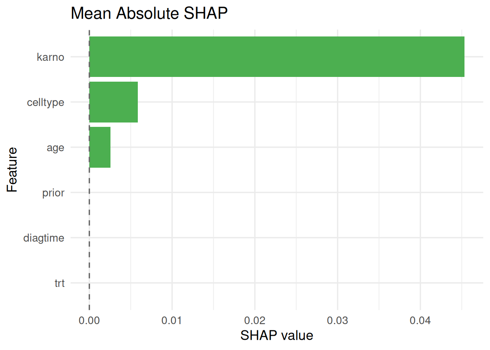
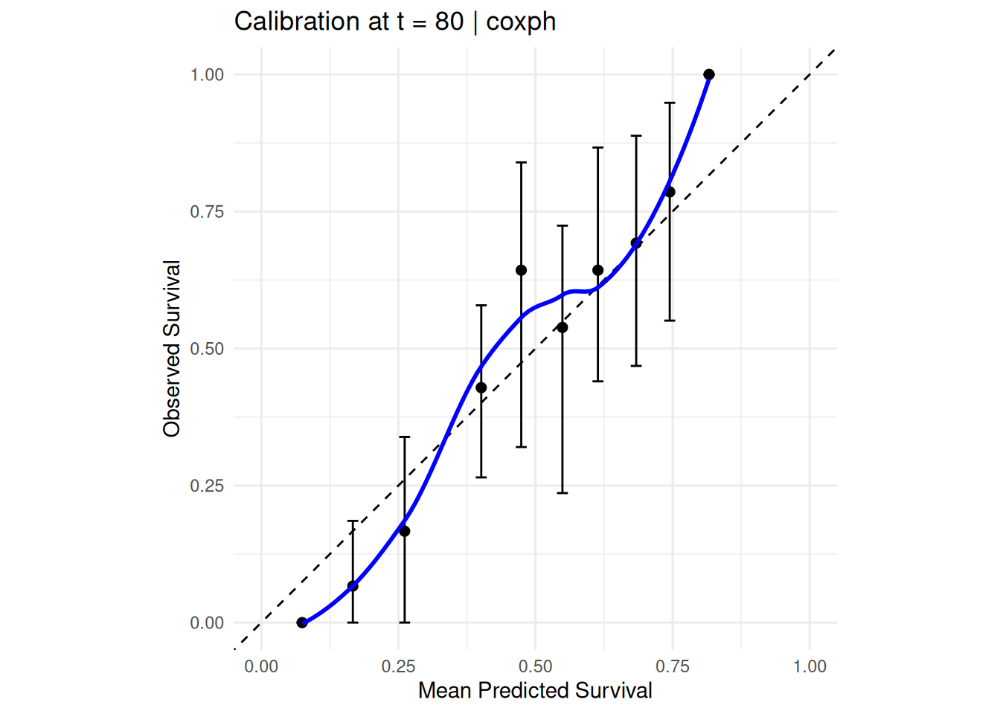

# Survalis: Unified Survival Machine Learning and Interpretability in R

`survalis` provides a standardized and modular framework for survival
machine learning survival analysis in R. It supports a wide range of
learners, evaluation metrics, cross-validation and interpretability
methods.

## Installation

``` r
# Install from GitHub
remotes::install_github("ielbadisy/survalis")

# Or from source
install.packages("survalis_0.6.0.tar.gz", repos = NULL, type = "source")
```

## Core philosophy

- Consistent function patterns: `fit_*()`, `predict_*()`, `tune_*()`
- Learners return standardized `mlsurv_model` objects
- Predictions return `data.frame` of survival probabilities: `t=100`,
  `t=200`, …
- Evaluation is fully modular: plug any `fit_*`/`predict_*` with
  `cv_survlearner()` or `score_survmodel()`
- Designed for interpretability post prediction.

## Exploring the package

### List all available survival learners

``` r
library(survalis)
# See all available learners
list_survlearners()
#> # A tibble: 19 × 8
#>    learner         fit      predict tune  has_fit has_predict has_tune available
#>    <chr>           <chr>    <chr>   <chr> <lgl>   <lgl>       <lgl>    <lgl>    
#>  1 coxph           fit_cox… predic… <NA>  TRUE    TRUE        FALSE    TRUE     
#>  2 aalen           fit_aal… predic… <NA>  TRUE    TRUE        FALSE    TRUE     
#>  3 glmnet          fit_glm… predic… tune… TRUE    TRUE        TRUE     TRUE     
#>  4 selectcox       fit_sel… predic… tune… TRUE    TRUE        TRUE     TRUE     
#>  5 aftgee          fit_aft… predic… <NA>  TRUE    TRUE        FALSE    TRUE     
#>  6 flexsurvreg     fit_fle… predic… tune… TRUE    TRUE        TRUE     TRUE     
#>  7 stpm2           fit_stp… predic… <NA>  TRUE    TRUE        FALSE    TRUE     
#>  8 bnnsurv         fit_bnn… predic… tune… TRUE    TRUE        TRUE     TRUE     
#>  9 rpart           fit_rpa… predic… tune… TRUE    TRUE        TRUE     TRUE     
#> 10 bart            fit_bart predic… tune… TRUE    TRUE        TRUE     TRUE     
#> 11 xgboost         fit_xgb… predic… tune… TRUE    TRUE        TRUE     TRUE     
#> 12 ranger          fit_ran… predic… tune… TRUE    TRUE        TRUE     TRUE     
#> 13 rsf             fit_rsf  predic… tune… TRUE    TRUE        TRUE     TRUE     
#> 14 cforest         fit_cfo… predic… tune… TRUE    TRUE        TRUE     TRUE     
#> 15 blackboost      fit_bla… predic… tune… TRUE    TRUE        TRUE     TRUE     
#> 16 survsvm         fit_sur… predic… tune… TRUE    TRUE        TRUE     TRUE     
#> 17 survdnn         fit_sur… predic… tune… TRUE    TRUE        TRUE     TRUE     
#> 18 orsf            fit_orsf predic… tune… TRUE    TRUE        TRUE     TRUE     
#> 19 survmetalearner fit_sur… predic… <NA>  TRUE    TRUE        FALSE    TRUE

# See only tunable learners (those with a tune_* function)
list_survlearners(has_tune = TRUE)
#> # A tibble: 14 × 8
#>    learner     fit          predict tune  has_fit has_predict has_tune available
#>    <chr>       <chr>        <chr>   <chr> <lgl>   <lgl>       <lgl>    <lgl>    
#>  1 glmnet      fit_glmnet   predic… tune… TRUE    TRUE        TRUE     TRUE     
#>  2 selectcox   fit_selectc… predic… tune… TRUE    TRUE        TRUE     TRUE     
#>  3 flexsurvreg fit_flexsur… predic… tune… TRUE    TRUE        TRUE     TRUE     
#>  4 bnnsurv     fit_bnnsurv  predic… tune… TRUE    TRUE        TRUE     TRUE     
#>  5 rpart       fit_rpart    predic… tune… TRUE    TRUE        TRUE     TRUE     
#>  6 bart        fit_bart     predic… tune… TRUE    TRUE        TRUE     TRUE     
#>  7 xgboost     fit_xgboost  predic… tune… TRUE    TRUE        TRUE     TRUE     
#>  8 ranger      fit_ranger   predic… tune… TRUE    TRUE        TRUE     TRUE     
#>  9 rsf         fit_rsf      predic… tune… TRUE    TRUE        TRUE     TRUE     
#> 10 cforest     fit_cforest  predic… tune… TRUE    TRUE        TRUE     TRUE     
#> 11 blackboost  fit_blackbo… predic… tune… TRUE    TRUE        TRUE     TRUE     
#> 12 survsvm     fit_survsvm  predic… tune… TRUE    TRUE        TRUE     TRUE     
#> 13 survdnn     fit_survdnn  predic… tune… TRUE    TRUE        TRUE     TRUE     
#> 14 orsf        fit_orsf     predic… tune… TRUE    TRUE        TRUE     TRUE

# Shortcut for tunable learners
list_tunable_survlearners()
#> # A tibble: 14 × 8
#>    learner     fit          predict tune  has_fit has_predict has_tune available
#>    <chr>       <chr>        <chr>   <chr> <lgl>   <lgl>       <lgl>    <lgl>    
#>  1 glmnet      fit_glmnet   predic… tune… TRUE    TRUE        TRUE     TRUE     
#>  2 selectcox   fit_selectc… predic… tune… TRUE    TRUE        TRUE     TRUE     
#>  3 flexsurvreg fit_flexsur… predic… tune… TRUE    TRUE        TRUE     TRUE     
#>  4 bnnsurv     fit_bnnsurv  predic… tune… TRUE    TRUE        TRUE     TRUE     
#>  5 rpart       fit_rpart    predic… tune… TRUE    TRUE        TRUE     TRUE     
#>  6 bart        fit_bart     predic… tune… TRUE    TRUE        TRUE     TRUE     
#>  7 xgboost     fit_xgboost  predic… tune… TRUE    TRUE        TRUE     TRUE     
#>  8 ranger      fit_ranger   predic… tune… TRUE    TRUE        TRUE     TRUE     
#>  9 rsf         fit_rsf      predic… tune… TRUE    TRUE        TRUE     TRUE     
#> 10 cforest     fit_cforest  predic… tune… TRUE    TRUE        TRUE     TRUE     
#> 11 blackboost  fit_blackbo… predic… tune… TRUE    TRUE        TRUE     TRUE     
#> 12 survsvm     fit_survsvm  predic… tune… TRUE    TRUE        TRUE     TRUE     
#> 13 survdnn     fit_survdnn  predic… tune… TRUE    TRUE        TRUE     TRUE     
#> 14 orsf        fit_orsf     predic… tune… TRUE    TRUE        TRUE     TRUE
```

### List interpretability tools

``` r
# List available interpretability methods
list_interpretability_methods()
#> # A tibble: 8 × 4
#>   compute                plot                has_compute has_plot
#>   <chr>                  <chr>               <lgl>       <lgl>   
#> 1 compute_shap           plot_shap           TRUE        TRUE    
#> 2 compute_pdp            plot_pdp            TRUE        TRUE    
#> 3 compute_ale            plot_ale            TRUE        TRUE    
#> 4 compute_surrogate      plot_surrogate      TRUE        TRUE    
#> 5 compute_tree_surrogate plot_tree_surrogate TRUE        TRUE    
#> 6 compute_varimp         plot_varimp         TRUE        TRUE    
#> 7 compute_interactions   plot_interactions   TRUE        TRUE    
#> 8 compute_counterfactual <NA>                TRUE        FALSE

# Show which compute_* methods have a plot_* counterpart
subset(list_interpretability_methods(), !is.na(plot))
#> # A tibble: 7 × 4
#>   compute                plot                has_compute has_plot
#>   <chr>                  <chr>               <lgl>       <lgl>   
#> 1 compute_shap           plot_shap           TRUE        TRUE    
#> 2 compute_pdp            plot_pdp            TRUE        TRUE    
#> 3 compute_ale            plot_ale            TRUE        TRUE    
#> 4 compute_surrogate      plot_surrogate      TRUE        TRUE    
#> 5 compute_tree_surrogate plot_tree_surrogate TRUE        TRUE    
#> 6 compute_varimp         plot_varimp         TRUE        TRUE    
#> 7 compute_interactions   plot_interactions   TRUE        TRUE
```

### List evaluation metrics

``` r
# List available metrics used in cross-validation and scoring
list_metrics()
#> # A tibble: 3 × 4
#>   metric direction summary                                                 range
#>   <chr>  <chr>     <chr>                                                   <chr>
#> 1 cindex maximize  Harrell-style concordance index for survival predictio… [0, …
#> 2 brier  minimize  Brier Score at specified evaluation time(s) (IPCW-weig… [0, …
#> 3 ibs    minimize  Integrated Brier Score over an evaluation time grid (I… [0, …
```

## Basic Workflow

**1. Fit a model**

``` r
mod_cox <- fit_coxph(Surv(time, status) ~ age + karno + celltype, data = veteran)
summary(mod_cox)
#> 
#> ── coxph summary ───────────────────────────────────────────────────────────────────────────
#> Formula:
#> Surv(time, status) ~ age + karno + celltype
#> Engine: survival
#> Learner: coxph
#> Data summary:
#> - Observations: 137
#> - Predictors: "age, karno, celltypesmallcell, celltypeadeno, celltypelarge"
#> - Time range: [1, 999]
#> - Event rate: "93.4%"
```

**2. Predict survival probabilities**

``` r
pred <- predict_coxph(mod_cox, newdata = veteran[1:5, ], times = c(100, 200))
pred
#>       t=100     t=200
#> 1 0.6142681 0.3541697
#> 2 0.6944383 0.4599242
#> 3 0.5556797 0.2860796
#> 4 0.6033305 0.3408724
#> 5 0.6959633 0.4620783
```

**3. Evaluate model performance**

Direct evalution (single split):

``` r
score <- score_survmodel(mod_cox, times = c(100, 200), metrics = c("cindex", "ibs"))
score
#> # A tibble: 2 × 2
#>   metric value
#>   <chr>  <dbl>
#> 1 cindex 0.734
#> 2 ibs    0.160
```

``` r
cv_res <- cv_survlearner(
  Surv(time, status) ~ age + karno + celltype,
  veteran,
  fit_coxph,
  predict_coxph,
  times  = 80,
  metrics = c("cindex", "ibs"),
  folds = 5,
  seed = 123,
  verbose = FALSE
  )

cv_res
#> # A tibble: 10 × 5
#>    splits           id     fold metric value
#>    <list>           <chr> <int> <chr>  <dbl>
#>  1 <split [109/28]> Fold1     1 cindex 0.699
#>  2 <split [109/28]> Fold1     1 ibs    0.227
#>  3 <split [109/28]> Fold2     2 cindex 0.812
#>  4 <split [109/28]> Fold2     2 ibs    0.141
#>  5 <split [110/27]> Fold3     3 cindex 0.695
#>  6 <split [110/27]> Fold3     3 ibs    0.217
#>  7 <split [110/27]> Fold4     4 cindex 0.698
#>  8 <split [110/27]> Fold4     4 ibs    0.188
#>  9 <split [110/27]> Fold5     5 cindex 0.688
#> 10 <split [110/27]> Fold5     5 ibs    0.138
```

``` r
cv_summary(cv_res)
#> # A tibble: 2 × 7
#>   metric  mean     sd     n     se lower upper
#>   <chr>  <dbl>  <dbl> <int>  <dbl> <dbl> <dbl>
#> 1 cindex 0.718 0.0528     5 0.0236 0.672 0.765
#> 2 ibs    0.182 0.0417     5 0.0186 0.146 0.219
```

**4. Visualize interpretation**

``` r
shap_meanabs <- compute_shap(
  model         = mod_cox,
  newdata       = veteran[100,],
  baseline_data = veteran,
  times         = 80,
  sample.size   = 50,
  aggregate     = TRUE,
  method        = "meanabs"
  )

shap_meanabs
#>           feature         phi
#> trt           trt 0.000000000
#> celltype celltype 0.005850095
#> karno       karno 0.045326970
#> diagtime diagtime 0.000000000
#> age           age 0.002540069
#> prior       prior 0.000000000
```

``` r
plot_shap(shap_meanabs)
```



**5. Calibration**

``` r
compute_calibration(
   model = mod_cox, data = veteran,
   time = "time", status = "status",
   eval_time = 80, n_bins = 10, n_boot = 30
   ) |> plot_calibration()
```



## Citing

``` r
citation("survalis")
```
