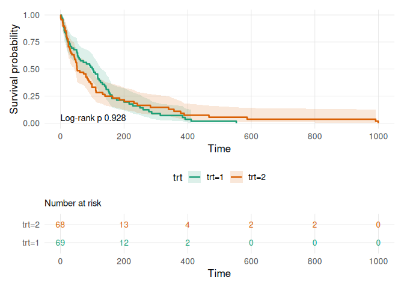
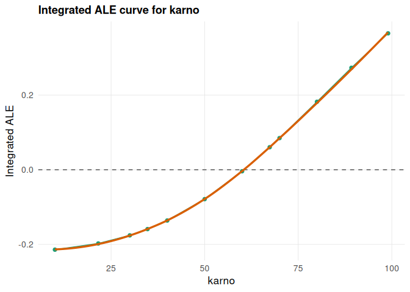
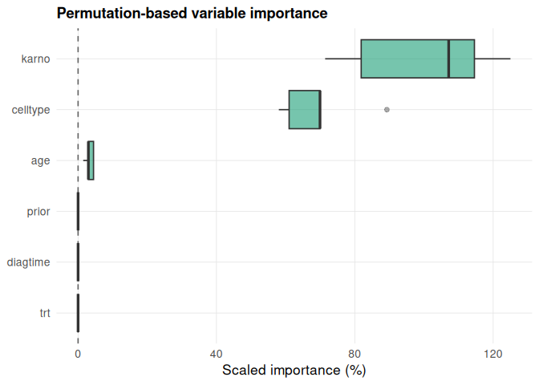
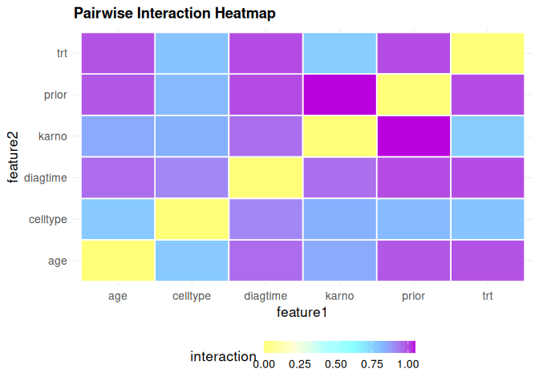
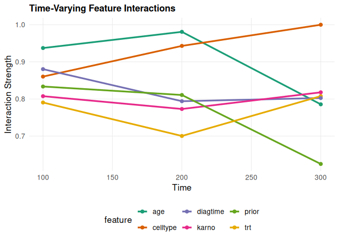
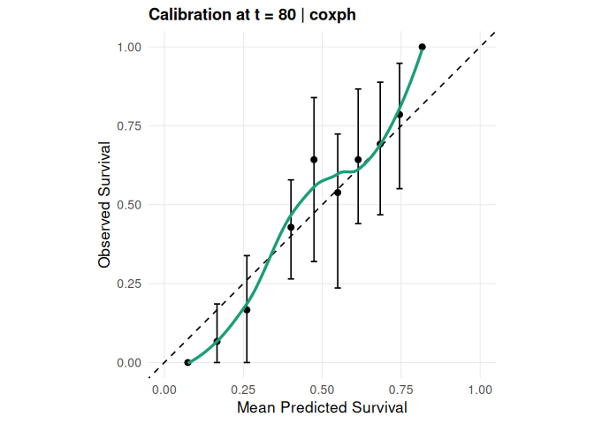

# Survalis: Unified Survival Machine Learning and Interpretability in R

<!-- badges: start -->

[](https://CRAN.R-project.org/package=survalis)
[](https://github.com/ielbadisy/survalis/actions/workflows/R-CMD-check.yaml)
[](https://CRAN.R-project.org/package=survalis)
[](https://opensource.org/licenses/MIT)
<!-- badges: end -->

`survalis` provides a unified framework for survival machine learning in
R. It supports 22 learners, evaluation metrics, cross-validation,
benchmarking, and model-agnostic interpretability methods through a
common survival-probability matrix (`survmat`) interface.

`survalis` is available on CRAN:
<https://CRAN.R-project.org/package=survalis>.

## New in version 1.3.0: the seven-verb interface

``` r
library(survalis)
f <- Surv(time, status) ~ age + karno + celltype

m   <- fit(f, veteran, model = "ranger", spec = list(num.trees = 500))
predict(m, veteran[1:5, ], times = c(90, 180, 365))          # survmat
evaluate(m, times = c(90, 180, 365), resampling = cv(5))     # resampled metrics

cmp <- compare(f, veteran, models = c("coxph", "ranger", "survdnn"),
               times = c(90, 180, 365))
plot(cmp)

plot(interpret(m, "shap", newdata = veteran[1, ], times = 180))
estimate(f, veteran, model = "ranger", treatment = "trt", tau = 365)
```

`fit()` / `predict()` / `evaluate()` / `tune()` / `compare()` /
`interpret()` / `estimate()` cover the whole workflow. The granular
`fit_*()` / `predict_*()` / `compute_*()` / `benchmark*()` functions
remain fully available; see `vignette("from-1.0", package = "survalis")`
and `?`survalis-deprecated\`\`.

## Installation

``` r
# Install the released version from CRAN
install.packages("survalis")

# Or install the development version from GitHub
remotes::install_github("ielbadisy/survalis")
```

## New in version 1.1.0

Version 1.1.0 adds a set of downstream tools that work with the same
fitted models and `survmat` predictions used throughout the package:

- `screen_fdr()` performs univariate Cox screening with
  Benjamini-Hochberg FDR control and an optional minimum-screen
  guarantee.
- `estimate_rmst()` and `plot_rmst()` estimate standardized marginal
  RMST or a two-group RMST contrast with percentile-bootstrap intervals.
- `compute_shap_matrix()` and `plot_shap_beeswarm()` summarize
  time-integrated SHAP contributions across observations.
- `roc_survmat()` and `dca_survmat()` provide IPCW time-dependent ROC
  and decision-curve analyses, with `plot_roc()` and `plot_dca()`
  helpers.

``` r
# FDR screening
selected <- screen_fdr(
  Surv(time, status) ~ age + karno + diagtime + prior,
  data = veteran,
  alpha = 0.1,
  minscreen = 2
)

# Standardized RMST contrast between treatment groups
rmst <- estimate_rmst(
  mod_cox,
  data = veteran,
  tau = 200,
  times = seq(10, 300, by = 10),
  trt_col = "trt",
  R = 200,
  seed = 1
)

# Time-dependent ROC and decision curves from survmat predictions
pred_100 <- predict_coxph(mod_cox, veteran, times = 100)
roc <- roc_survmat(Surv(veteran$time, veteran$status), pred_100, t_star = 100)
dca <- dca_survmat(Surv(veteran$time, veteran$status), pred_100, t_star = 100)
plot_roc(roc)
plot_dca(dca)
```

## Core philosophy

- Seven verbs cover the whole workflow: `fit()`, `predict()`,
  `evaluate()`, `tune()`, `compare()`, `interpret()`, `estimate()`
- Every learner returns a standardized `survalis_fit` (a `mlsurv_model`
  subclass)
- Matrix predictions return a `survmat`: columns `t=100`, `t=200`, …,
  with the grid recorded in `attr(x, "times")`
- Evaluation is fully modular: any learner id works with
  `evaluate()`/`compare()` under any
  `cv()`/`holdout()`/`group_cv()`/`bootstrap()` resampling
- Designed for interpretability post prediction, through a single
  `interpret()` entry point

## Exploring the package

### List all available survival learners

``` r
library(survalis)
# See all available learners
list_survlearners()
#>             learner                 fit                 predict
#>              <char>              <char>                  <char>
#>  1:           coxph           fit_coxph           predict_coxph
#>  2:           aalen           fit_aalen           predict_aalen
#>  3:          glmnet          fit_glmnet          predict_glmnet
#>  4:       selectcox       fit_selectcox       predict_selectcox
#>  5:          aftgee          fit_aftgee          predict_aftgee
#>  6:     flexsurvreg     fit_flexsurvreg     predict_flexsurvreg
#>  7:           stpm2           fit_stpm2           predict_stpm2
#>  8:         bnnsurv         fit_bnnsurv         predict_bnnsurv
#>  9:           rpart           fit_rpart           predict_rpart
#> 10:            bart            fit_bart            predict_bart
#> 11:         xgboost         fit_xgboost         predict_xgboost
#> 12:        coxboost        fit_coxboost        predict_coxboost
#> 13:         fastgbm         fit_fastgbm         predict_fastgbm
#> 14:          ranger          fit_ranger          predict_ranger
#> 15:             rsf             fit_rsf             predict_rsf
#> 16:         cforest         fit_cforest         predict_cforest
#> 17:      blackboost      fit_blackboost      predict_blackboost
#> 18:         survsvm         fit_survsvm         predict_survsvm
#> 19:         survdnn         fit_survdnn         predict_survdnn
#> 20:        densemlp        fit_densemlp        predict_densemlp
#> 21:            orsf            fit_orsf            predict_orsf
#> 22: survmetalearner fit_survmetalearner predict_survmetalearner
#>             learner                 fit                 predict
#>              <char>              <char>                  <char>
#>                 tune has_fit has_predict has_tune available
#>               <char>  <lgcl>      <lgcl>   <lgcl>    <lgcl>
#>  1:             <NA>    TRUE        TRUE    FALSE      TRUE
#>  2:             <NA>    TRUE        TRUE    FALSE      TRUE
#>  3:      tune_glmnet    TRUE        TRUE     TRUE      TRUE
#>  4:   tune_selectcox    TRUE        TRUE     TRUE      TRUE
#>  5:             <NA>    TRUE        TRUE    FALSE      TRUE
#>  6: tune_flexsurvreg    TRUE        TRUE     TRUE      TRUE
#>  7:             <NA>    TRUE        TRUE    FALSE      TRUE
#>  8:     tune_bnnsurv    TRUE        TRUE     TRUE      TRUE
#>  9:       tune_rpart    TRUE        TRUE     TRUE      TRUE
#> 10:        tune_bart    TRUE        TRUE     TRUE      TRUE
#> 11:     tune_xgboost    TRUE        TRUE     TRUE      TRUE
#> 12:    tune_coxboost    TRUE        TRUE     TRUE      TRUE
#> 13:             <NA>    TRUE        TRUE    FALSE      TRUE
#> 14:      tune_ranger    TRUE        TRUE     TRUE      TRUE
#> 15:         tune_rsf    TRUE        TRUE     TRUE      TRUE
#> 16:     tune_cforest    TRUE        TRUE     TRUE      TRUE
#> 17:  tune_blackboost    TRUE        TRUE     TRUE      TRUE
#> 18:     tune_survsvm    TRUE        TRUE     TRUE      TRUE
#> 19:     tune_survdnn    TRUE        TRUE     TRUE      TRUE
#> 20:             <NA>    TRUE        TRUE    FALSE      TRUE
#> 21:        tune_orsf    TRUE        TRUE     TRUE      TRUE
#> 22:             <NA>    TRUE        TRUE    FALSE      TRUE
#>                 tune has_fit has_predict has_tune available
#>               <char>  <lgcl>      <lgcl>   <lgcl>    <lgcl>

# See only tunable learners (those with a tune_* function)
list_survlearners(has_tune = TRUE)
#>         learner             fit             predict             tune has_fit
#>          <char>          <char>              <char>           <char>  <lgcl>
#>  1:      glmnet      fit_glmnet      predict_glmnet      tune_glmnet    TRUE
#>  2:   selectcox   fit_selectcox   predict_selectcox   tune_selectcox    TRUE
#>  3: flexsurvreg fit_flexsurvreg predict_flexsurvreg tune_flexsurvreg    TRUE
#>  4:     bnnsurv     fit_bnnsurv     predict_bnnsurv     tune_bnnsurv    TRUE
#>  5:       rpart       fit_rpart       predict_rpart       tune_rpart    TRUE
#>  6:        bart        fit_bart        predict_bart        tune_bart    TRUE
#>  7:     xgboost     fit_xgboost     predict_xgboost     tune_xgboost    TRUE
#>  8:    coxboost    fit_coxboost    predict_coxboost    tune_coxboost    TRUE
#>  9:      ranger      fit_ranger      predict_ranger      tune_ranger    TRUE
#> 10:         rsf         fit_rsf         predict_rsf         tune_rsf    TRUE
#> 11:     cforest     fit_cforest     predict_cforest     tune_cforest    TRUE
#> 12:  blackboost  fit_blackboost  predict_blackboost  tune_blackboost    TRUE
#> 13:     survsvm     fit_survsvm     predict_survsvm     tune_survsvm    TRUE
#> 14:     survdnn     fit_survdnn     predict_survdnn     tune_survdnn    TRUE
#> 15:        orsf        fit_orsf        predict_orsf        tune_orsf    TRUE
#>     has_predict has_tune available
#>          <lgcl>   <lgcl>    <lgcl>
#>  1:        TRUE     TRUE      TRUE
#>  2:        TRUE     TRUE      TRUE
#>  3:        TRUE     TRUE      TRUE
#>  4:        TRUE     TRUE      TRUE
#>  5:        TRUE     TRUE      TRUE
#>  6:        TRUE     TRUE      TRUE
#>  7:        TRUE     TRUE      TRUE
#>  8:        TRUE     TRUE      TRUE
#>  9:        TRUE     TRUE      TRUE
#> 10:        TRUE     TRUE      TRUE
#> 11:        TRUE     TRUE      TRUE
#> 12:        TRUE     TRUE      TRUE
#> 13:        TRUE     TRUE      TRUE
#> 14:        TRUE     TRUE      TRUE
#> 15:        TRUE     TRUE      TRUE

# Shortcut for tunable learners
list_tunable_survlearners()
#>         learner             fit             predict             tune has_fit
#>          <char>          <char>              <char>           <char>  <lgcl>
#>  1:      glmnet      fit_glmnet      predict_glmnet      tune_glmnet    TRUE
#>  2:   selectcox   fit_selectcox   predict_selectcox   tune_selectcox    TRUE
#>  3: flexsurvreg fit_flexsurvreg predict_flexsurvreg tune_flexsurvreg    TRUE
#>  4:     bnnsurv     fit_bnnsurv     predict_bnnsurv     tune_bnnsurv    TRUE
#>  5:       rpart       fit_rpart       predict_rpart       tune_rpart    TRUE
#>  6:        bart        fit_bart        predict_bart        tune_bart    TRUE
#>  7:     xgboost     fit_xgboost     predict_xgboost     tune_xgboost    TRUE
#>  8:    coxboost    fit_coxboost    predict_coxboost    tune_coxboost    TRUE
#>  9:      ranger      fit_ranger      predict_ranger      tune_ranger    TRUE
#> 10:         rsf         fit_rsf         predict_rsf         tune_rsf    TRUE
#> 11:     cforest     fit_cforest     predict_cforest     tune_cforest    TRUE
#> 12:  blackboost  fit_blackboost  predict_blackboost  tune_blackboost    TRUE
#> 13:     survsvm     fit_survsvm     predict_survsvm     tune_survsvm    TRUE
#> 14:     survdnn     fit_survdnn     predict_survdnn     tune_survdnn    TRUE
#> 15:        orsf        fit_orsf        predict_orsf        tune_orsf    TRUE
#>     has_predict has_tune available
#>          <lgcl>   <lgcl>    <lgcl>
#>  1:        TRUE     TRUE      TRUE
#>  2:        TRUE     TRUE      TRUE
#>  3:        TRUE     TRUE      TRUE
#>  4:        TRUE     TRUE      TRUE
#>  5:        TRUE     TRUE      TRUE
#>  6:        TRUE     TRUE      TRUE
#>  7:        TRUE     TRUE      TRUE
#>  8:        TRUE     TRUE      TRUE
#>  9:        TRUE     TRUE      TRUE
#> 10:        TRUE     TRUE      TRUE
#> 11:        TRUE     TRUE      TRUE
#> 12:        TRUE     TRUE      TRUE
#> 13:        TRUE     TRUE      TRUE
#> 14:        TRUE     TRUE      TRUE
#> 15:        TRUE     TRUE      TRUE
```

### List interpretability tools

``` r
# List available interpretability methods
list_interpretability_methods()
#>                    compute                plot has_compute has_plot
#>                     <char>              <char>      <lgcl>   <lgcl>
#>  1:           compute_shap           plot_shap        TRUE     TRUE
#>  2:            compute_pdp            plot_pdp        TRUE     TRUE
#>  3:            compute_ale            plot_ale        TRUE     TRUE
#>  4:      compute_surrogate      plot_surrogate        TRUE     TRUE
#>  5: compute_tree_surrogate plot_tree_surrogate        TRUE     TRUE
#>  6:         compute_varimp         plot_varimp        TRUE     TRUE
#>  7:   compute_interactions   plot_interactions        TRUE     TRUE
#>  8: compute_counterfactual plot_counterfactual        TRUE     TRUE
#>  9:    compute_shap_matrix  plot_shap_beeswarm        TRUE     TRUE
#> 10:    compute_survcluster    plot_survcluster        TRUE     TRUE

# Show which compute_* methods have a plot_* counterpart
subset(list_interpretability_methods(), !is.na(plot))
#>                    compute                plot has_compute has_plot
#>                     <char>              <char>      <lgcl>   <lgcl>
#>  1:           compute_shap           plot_shap        TRUE     TRUE
#>  2:            compute_pdp            plot_pdp        TRUE     TRUE
#>  3:            compute_ale            plot_ale        TRUE     TRUE
#>  4:      compute_surrogate      plot_surrogate        TRUE     TRUE
#>  5: compute_tree_surrogate plot_tree_surrogate        TRUE     TRUE
#>  6:         compute_varimp         plot_varimp        TRUE     TRUE
#>  7:   compute_interactions   plot_interactions        TRUE     TRUE
#>  8: compute_counterfactual plot_counterfactual        TRUE     TRUE
#>  9:    compute_shap_matrix  plot_shap_beeswarm        TRUE     TRUE
#> 10:    compute_survcluster    plot_survcluster        TRUE     TRUE
```

### List evaluation metrics

``` r
# List available metrics used in cross-validation and scoring
list_metrics()
#>    metric direction
#>    <char>    <char>
#> 1: cindex  maximize
#> 2:    auc  maximize
#> 3:  brier  minimize
#> 4:    ibs  minimize
#> 5:    iae  minimize
#> 6:    ise  minimize
#> 7:    ece  minimize
#>                                                                     summary
#>                                                                      <char>
#> 1:                Harrell-style concordance index for survival predictions.
#> 2:     Cumulative/dynamic time-dependent AUC at a selected evaluation time.
#> 3: Brier Score at specified evaluation time(s) (IPCW-weighted when needed).
#> 4:     Integrated Brier Score over an evaluation time grid (IPCW-weighted).
#> 5:                Integrated absolute error against the Kaplan-Meier curve.
#> 6:                 Integrated squared error against the Kaplan-Meier curve.
#> 7:                  Expected calibration error at a single evaluation time.
#>                         range
#>                        <char>
#> 1:  [0, 1] (higher is better)
#> 2:  [0, 1] (higher is better)
#> 3:   [0, 1] (lower is better)
#> 4:   [0, 1] (lower is better)
#> 5: [0, Inf) (lower is better)
#> 6: [0, Inf) (lower is better)
#> 7:   [0, 1] (lower is better)
```

## Basic Workflow

**1. Fit a model**

``` r
mod_cox <- fit(Surv(time, status) ~ age + karno + celltype, veteran, model = "coxph")
mod_cox
#> <survalis_fit> model = coxph  (engine: survival)
#>   formula: Surv(time, status) ~ age + karno + celltype
#>   data:    137 obs, 128 events (93%)
```

**2. Predict survival probabilities**

``` r
pred <- predict(mod_cox, newdata = veteran[1:5, ], times = c(100, 200))
pred
#> <survmat> survival  |  5 obs x 2 times  [100, 200]
#>          t=100     t=200
#> [1,] 0.6142681 0.3541697
#> [2,] 0.6944383 0.4599242
#> [3,] 0.5556797 0.2860796
#> [4,] 0.6033305 0.3408724
#> [5,] 0.6959633 0.4620783
```

`predict()` also returns other quantities via `type`: `"risk"` (1 -
S(t)), `"chf"`, `"hazard"`, `"rmst"`, `"quantile"`, `"median"`.

**3. Evaluate model performance**

``` r
ev <- evaluate(mod_cox, times = c(80, 160), resampling = cv(5, seed = 123))
ev
#> <survalis_eval> model = coxph
#> <survalis_resampling> 5-fold CV, strata = status, seed = 123
#>   grid: 2 times in [80, 160]
#>   cindex  0.7180  (sd 0.0530, 95% [0.6720, 0.7640], n = 5)
#>   ibs     0.1820  (sd 0.0420, 95% [0.1460, 0.2190], n = 5)
```

``` r
summary(ev)
#>   metric  mean    sd n    se lower upper
#> 1 cindex 0.718 0.053 5 0.023 0.672 0.764
#> 2    ibs 0.182 0.042 5 0.019 0.146 0.219
```

**4. Compare multiple learners**

`compare()` evaluates every learner on the *same* resampling folds, so
results are paired; `tune = TRUE` tunes each tunable learner first.

``` r
cmp <- compare(
  Surv(time, status) ~ age + karno + celltype,
  data = veteran,
  models = c("coxph", "rpart", "ranger"),
  times = c(80, 160),
  resampling = cv(3, seed = 1)
  )

cmp
#> <survalis_compare> 3 models
#> <survalis_resampling> 3-fold CV, strata = status, seed = 1
#> 
#>   cindex (higher is better):
#>    * coxph            0.7307  (se 0.0188)
#>      rpart            0.7073  (se 0.0171)
#>      ranger           0.6890  (se 0.0239)
#> 
#>   ibs (lower is better):
#>    * coxph            0.1790  (se 0.0055)
#>      ranger           0.1990  (se 0.0042)
#>      rpart            0.2160  (se 0.0062)
plot(cmp)
```


**5. Kaplan-Meier curves**

`plot_survcurve()` produces a styled Kaplan-Meier curve with a
confidence ribbon, log-rank p-value, and an aligned number-at-risk
table, in the spirit of `survminer::ggsurvplot()` but implemented
natively (no dependency on survminer).

``` r
plot_survcurve(Surv(time, status) ~ trt, data = veteran)
#> Warning: Removed 2 rows containing missing values or values outside the scale range
#> (`geom_ribbon()`).
```



**6. Visualize interpretation**

`interpret()` is the single entry point to every explanation method; its
`plot()` dispatches to the matching `plot_*()` helper.

``` r
shap_meanabs <- interpret(
  mod_cox, "shap",
  newdata     = veteran[100, ],
  times       = 80,
  sample.size = 50,
  aggregate   = TRUE,
  shap_method = "meanabs"
  )

as.data.frame(shap_meanabs)
#>           feature         phi
#> age           age 0.001231928
#> celltype celltype 0.017380404
#> diagtime diagtime 0.000000000
#> karno       karno 0.019501719
#> prior       prior 0.000000000
#> trt           trt 0.000000000
```

``` r
plot(shap_meanabs)
```


### More interpretability methods

`survalis` also provides PDP, ALE, surrogate explanations, tree
surrogates, permutation importance, interaction analysis, and
counterfactuals – all through `interpret(fit, method = ..., ...)`.

**Partial dependence and ICE**

``` r
pdp_age <- interpret(mod_cox, "pdp", feature = "age", times = c(100, 200, 300))

plot(pdp_age, which = "per_time")
```


``` r
plot(pdp_age, which = "integrated", smooth = TRUE)
#> `geom_smooth()` using formula = 'y ~ x'
```


**Accumulated local effects**

``` r
ale_karno <- interpret(mod_cox, "ale", feature = "karno", times = c(100, 200, 300))

plot(ale_karno, which = "per_time")
```


``` r
plot(ale_karno, which = "integrated", smooth = TRUE)
#> `geom_smooth()` using formula = 'y ~ x'
```



**Local surrogate explanation**

``` r
local_surrogate <- interpret(
  mod_cox, "surrogate",
  newdata     = veteran[1, , drop = FALSE],
  times       = c(100, 200, 300),
  target_time = 200,
  k           = 5
  )

as.data.frame(local_surrogate)
#>    feature feature_value      effect target_time
#> 1    karno            60 0.491034890         200
#> 2 celltype      squamous 0.189632633         200
#> 3      age            69 0.120729843         200
#> 4 diagtime             7 0.001800378         200
#> 5    prior             0 0.000000000         200
plot(local_surrogate, top_n = 10)
```


**Tree surrogate**

``` r
tree_surrogate <- interpret(mod_cox, "tree_surrogate", times = c(100, 200, 300))

plot(tree_surrogate, type = "importance", top_n = 5)
```


``` r
# plot(tree_surrogate, type = "tree")
```

**Permutation variable importance**

``` r
varimp_res <- interpret(
  mod_cox, "varimp",
  times          = c(100, 200, 300),
  metric         = "ibs",
  n_repetitions  = 5,
  seed           = 123
  )

as.data.frame(varimp_res)
#>     feature importance importance_05 importance_95 scaled_importance
#>      <char>      <num>         <num>         <num>             <num>
#> 1:    karno     0.0672        0.0494        0.0826         100.00000
#> 2: celltype     0.0468        0.0394        0.0574          69.64286
#> 3:      age    -0.0022       -0.0030       -0.0012           3.27381
#> 4:      trt     0.0000        0.0000        0.0000           0.00000
#> 5: diagtime     0.0000        0.0000        0.0000           0.00000
#> 6:    prior     0.0000        0.0000        0.0000           0.00000
plot(varimp_res)
```


**Feature interactions**

``` r
interaction_1way <- interpret(mod_cox, "interaction", times = c(100, 200, 300),
                              target_time = 200, type = "1way")
interaction_heatmap <- interpret(mod_cox, "interaction", times = c(100, 200, 300),
                                 target_time = 200, type = "heatmap")
interaction_time <- interpret(mod_cox, "interaction", times = c(100, 200, 300),
                              type = "time")

plot(interaction_1way, type = "1way")
```



``` r
plot(interaction_heatmap, type = "heatmap")
```



``` r
plot(interaction_time, type = "time")
```



**Counterfactual explanations**

``` r
counterfactuals <- interpret(
  mod_cox, "counterfactual",
  newdata            = veteran[1, , drop = FALSE],
  times              = c(100, 200, 300),
  target_time        = 200,
  features_to_change = c("age", "karno", "diagtime"),
  cost_penalty       = 0.01
  )

as.data.frame(counterfactuals)
#>    feature original_value suggested_value survival_gain change_cost
#> 1    karno             60         81.0202        0.2347     21.0202
#> 2 diagtime              7          7.0808        0.0000      0.0808
#> 3      age             69         69.1313        0.0003      0.1313
#>   penalized_gain
#> 1         0.0245
#> 2        -0.0008
#> 3        -0.0010
```

**7. Calibration**

``` r
interpret(mod_cox, "calibration", eval_time = 80, n_bins = 10, n_boot = 30) |> plot()
```



## Citing

``` r
citation("survalis")
```
