# Survalis: Unified Survival Machine Learning and Interpretability in R

<!-- badges: start -->

[](https://CRAN.R-project.org/package=survalis)
[](https://github.com/ielbadisy/survalis/actions/workflows/R-CMD-check.yaml)
[](https://CRAN.R-project.org/package=survalis)
[](https://opensource.org/licenses/MIT)
<!-- badges: end -->

`survalis` provides a unified framework for survival machine learning
survival analysis in R. It supports a wide range of learners, evaluation
metrics, cross-validation and interpretability methods.

`survalis` is available on CRAN:
<https://CRAN.R-project.org/package=survalis>.

## Installation

``` r
# Install the released version from CRAN
install.packages("survalis")

# Or install the development version from GitHub
remotes::install_github("ielbadisy/survalis")
```

## Core philosophy

- Consistent function patterns: `fit_*()`, `predict_*()`, `tune_*()`
- Learners return standardized `mlsurv_model` objects
- Predictions return `data.frame` of survival probabilities: `t=100`,
  `t=200`, …
- Evaluation is fully modular: plug any `fit_*`/`predict_*` with
  `cv_survlearner()` or `score_survmodel()`
- Designed for interpretability post prediction.

## Exploring the package

### List all available survival learners

``` r
library(survalis)
# See all available learners
list_survlearners()
#>             learner                 fit                 predict
#>              <char>              <char>                  <char>
#>  1:           coxph           fit_coxph           predict_coxph
#>  2:           aalen           fit_aalen           predict_aalen
#>  3:          glmnet          fit_glmnet          predict_glmnet
#>  4:       selectcox       fit_selectcox       predict_selectcox
#>  5:          aftgee          fit_aftgee          predict_aftgee
#>  6:     flexsurvreg     fit_flexsurvreg     predict_flexsurvreg
#>  7:           stpm2           fit_stpm2           predict_stpm2
#>  8:         bnnsurv         fit_bnnsurv         predict_bnnsurv
#>  9:           rpart           fit_rpart           predict_rpart
#> 10:            bart            fit_bart            predict_bart
#> 11:         xgboost         fit_xgboost         predict_xgboost
#> 12:        coxboost        fit_coxboost        predict_coxboost
#> 13:          ranger          fit_ranger          predict_ranger
#> 14:             rsf             fit_rsf             predict_rsf
#> 15:         cforest         fit_cforest         predict_cforest
#> 16:      blackboost      fit_blackboost      predict_blackboost
#> 17:         survsvm         fit_survsvm         predict_survsvm
#> 18:         survdnn         fit_survdnn         predict_survdnn
#> 19:            orsf            fit_orsf            predict_orsf
#> 20: survmetalearner fit_survmetalearner predict_survmetalearner
#>             learner                 fit                 predict
#>              <char>              <char>                  <char>
#>                 tune has_fit has_predict has_tune available
#>               <char>  <lgcl>      <lgcl>   <lgcl>    <lgcl>
#>  1:             <NA>    TRUE        TRUE    FALSE      TRUE
#>  2:             <NA>    TRUE        TRUE    FALSE      TRUE
#>  3:      tune_glmnet    TRUE        TRUE     TRUE      TRUE
#>  4:   tune_selectcox    TRUE        TRUE     TRUE      TRUE
#>  5:             <NA>    TRUE        TRUE    FALSE      TRUE
#>  6: tune_flexsurvreg    TRUE        TRUE     TRUE      TRUE
#>  7:             <NA>    TRUE        TRUE    FALSE      TRUE
#>  8:     tune_bnnsurv    TRUE        TRUE     TRUE      TRUE
#>  9:       tune_rpart    TRUE        TRUE     TRUE      TRUE
#> 10:        tune_bart    TRUE        TRUE     TRUE      TRUE
#> 11:     tune_xgboost    TRUE        TRUE     TRUE      TRUE
#> 12:    tune_coxboost    TRUE        TRUE     TRUE      TRUE
#> 13:      tune_ranger    TRUE        TRUE     TRUE      TRUE
#> 14:         tune_rsf    TRUE        TRUE     TRUE      TRUE
#> 15:     tune_cforest    TRUE        TRUE     TRUE      TRUE
#> 16:  tune_blackboost    TRUE        TRUE     TRUE      TRUE
#> 17:     tune_survsvm    TRUE        TRUE     TRUE      TRUE
#> 18:     tune_survdnn    TRUE        TRUE     TRUE      TRUE
#> 19:        tune_orsf    TRUE        TRUE     TRUE      TRUE
#> 20:             <NA>    TRUE        TRUE    FALSE      TRUE
#>                 tune has_fit has_predict has_tune available
#>               <char>  <lgcl>      <lgcl>   <lgcl>    <lgcl>

# See only tunable learners (those with a tune_* function)
list_survlearners(has_tune = TRUE)
#>         learner             fit             predict             tune has_fit
#>          <char>          <char>              <char>           <char>  <lgcl>
#>  1:      glmnet      fit_glmnet      predict_glmnet      tune_glmnet    TRUE
#>  2:   selectcox   fit_selectcox   predict_selectcox   tune_selectcox    TRUE
#>  3: flexsurvreg fit_flexsurvreg predict_flexsurvreg tune_flexsurvreg    TRUE
#>  4:     bnnsurv     fit_bnnsurv     predict_bnnsurv     tune_bnnsurv    TRUE
#>  5:       rpart       fit_rpart       predict_rpart       tune_rpart    TRUE
#>  6:        bart        fit_bart        predict_bart        tune_bart    TRUE
#>  7:     xgboost     fit_xgboost     predict_xgboost     tune_xgboost    TRUE
#>  8:    coxboost    fit_coxboost    predict_coxboost    tune_coxboost    TRUE
#>  9:      ranger      fit_ranger      predict_ranger      tune_ranger    TRUE
#> 10:         rsf         fit_rsf         predict_rsf         tune_rsf    TRUE
#> 11:     cforest     fit_cforest     predict_cforest     tune_cforest    TRUE
#> 12:  blackboost  fit_blackboost  predict_blackboost  tune_blackboost    TRUE
#> 13:     survsvm     fit_survsvm     predict_survsvm     tune_survsvm    TRUE
#> 14:     survdnn     fit_survdnn     predict_survdnn     tune_survdnn    TRUE
#> 15:        orsf        fit_orsf        predict_orsf        tune_orsf    TRUE
#>     has_predict has_tune available
#>          <lgcl>   <lgcl>    <lgcl>
#>  1:        TRUE     TRUE      TRUE
#>  2:        TRUE     TRUE      TRUE
#>  3:        TRUE     TRUE      TRUE
#>  4:        TRUE     TRUE      TRUE
#>  5:        TRUE     TRUE      TRUE
#>  6:        TRUE     TRUE      TRUE
#>  7:        TRUE     TRUE      TRUE
#>  8:        TRUE     TRUE      TRUE
#>  9:        TRUE     TRUE      TRUE
#> 10:        TRUE     TRUE      TRUE
#> 11:        TRUE     TRUE      TRUE
#> 12:        TRUE     TRUE      TRUE
#> 13:        TRUE     TRUE      TRUE
#> 14:        TRUE     TRUE      TRUE
#> 15:        TRUE     TRUE      TRUE

# Shortcut for tunable learners
list_tunable_survlearners()
#>         learner             fit             predict             tune has_fit
#>          <char>          <char>              <char>           <char>  <lgcl>
#>  1:      glmnet      fit_glmnet      predict_glmnet      tune_glmnet    TRUE
#>  2:   selectcox   fit_selectcox   predict_selectcox   tune_selectcox    TRUE
#>  3: flexsurvreg fit_flexsurvreg predict_flexsurvreg tune_flexsurvreg    TRUE
#>  4:     bnnsurv     fit_bnnsurv     predict_bnnsurv     tune_bnnsurv    TRUE
#>  5:       rpart       fit_rpart       predict_rpart       tune_rpart    TRUE
#>  6:        bart        fit_bart        predict_bart        tune_bart    TRUE
#>  7:     xgboost     fit_xgboost     predict_xgboost     tune_xgboost    TRUE
#>  8:    coxboost    fit_coxboost    predict_coxboost    tune_coxboost    TRUE
#>  9:      ranger      fit_ranger      predict_ranger      tune_ranger    TRUE
#> 10:         rsf         fit_rsf         predict_rsf         tune_rsf    TRUE
#> 11:     cforest     fit_cforest     predict_cforest     tune_cforest    TRUE
#> 12:  blackboost  fit_blackboost  predict_blackboost  tune_blackboost    TRUE
#> 13:     survsvm     fit_survsvm     predict_survsvm     tune_survsvm    TRUE
#> 14:     survdnn     fit_survdnn     predict_survdnn     tune_survdnn    TRUE
#> 15:        orsf        fit_orsf        predict_orsf        tune_orsf    TRUE
#>     has_predict has_tune available
#>          <lgcl>   <lgcl>    <lgcl>
#>  1:        TRUE     TRUE      TRUE
#>  2:        TRUE     TRUE      TRUE
#>  3:        TRUE     TRUE      TRUE
#>  4:        TRUE     TRUE      TRUE
#>  5:        TRUE     TRUE      TRUE
#>  6:        TRUE     TRUE      TRUE
#>  7:        TRUE     TRUE      TRUE
#>  8:        TRUE     TRUE      TRUE
#>  9:        TRUE     TRUE      TRUE
#> 10:        TRUE     TRUE      TRUE
#> 11:        TRUE     TRUE      TRUE
#> 12:        TRUE     TRUE      TRUE
#> 13:        TRUE     TRUE      TRUE
#> 14:        TRUE     TRUE      TRUE
#> 15:        TRUE     TRUE      TRUE
```

### List interpretability tools

``` r
# List available interpretability methods
list_interpretability_methods()
#>                   compute                plot has_compute has_plot
#>                    <char>              <char>      <lgcl>   <lgcl>
#> 1:           compute_shap           plot_shap        TRUE     TRUE
#> 2:            compute_pdp            plot_pdp        TRUE     TRUE
#> 3:            compute_ale            plot_ale        TRUE     TRUE
#> 4:      compute_surrogate      plot_surrogate        TRUE     TRUE
#> 5: compute_tree_surrogate plot_tree_surrogate        TRUE     TRUE
#> 6:         compute_varimp         plot_varimp        TRUE     TRUE
#> 7:   compute_interactions   plot_interactions        TRUE     TRUE
#> 8: compute_counterfactual plot_counterfactual        TRUE     TRUE

# Show which compute_* methods have a plot_* counterpart
subset(list_interpretability_methods(), !is.na(plot))
#>                   compute                plot has_compute has_plot
#>                    <char>              <char>      <lgcl>   <lgcl>
#> 1:           compute_shap           plot_shap        TRUE     TRUE
#> 2:            compute_pdp            plot_pdp        TRUE     TRUE
#> 3:            compute_ale            plot_ale        TRUE     TRUE
#> 4:      compute_surrogate      plot_surrogate        TRUE     TRUE
#> 5: compute_tree_surrogate plot_tree_surrogate        TRUE     TRUE
#> 6:         compute_varimp         plot_varimp        TRUE     TRUE
#> 7:   compute_interactions   plot_interactions        TRUE     TRUE
#> 8: compute_counterfactual plot_counterfactual        TRUE     TRUE
```

### List evaluation metrics

``` r
# List available metrics used in cross-validation and scoring
list_metrics()
#>    metric direction
#>    <char>    <char>
#> 1: cindex  maximize
#> 2:    auc  maximize
#> 3:  brier  minimize
#> 4:    ibs  minimize
#> 5:    iae  minimize
#> 6:    ise  minimize
#> 7:    ece  minimize
#>                                                                     summary
#>                                                                      <char>
#> 1:                Harrell-style concordance index for survival predictions.
#> 2:     Cumulative/dynamic time-dependent AUC at a selected evaluation time.
#> 3: Brier Score at specified evaluation time(s) (IPCW-weighted when needed).
#> 4:     Integrated Brier Score over an evaluation time grid (IPCW-weighted).
#> 5:                Integrated absolute error against the Kaplan-Meier curve.
#> 6:                 Integrated squared error against the Kaplan-Meier curve.
#> 7:                  Expected calibration error at a single evaluation time.
#>                         range
#>                        <char>
#> 1:  [0, 1] (higher is better)
#> 2:  [0, 1] (higher is better)
#> 3:   [0, 1] (lower is better)
#> 4:   [0, 1] (lower is better)
#> 5: [0, Inf) (lower is better)
#> 6: [0, Inf) (lower is better)
#> 7:   [0, 1] (lower is better)
```

## Basic Workflow

**1. Fit a model**

``` r
mod_cox <- fit_coxph(Surv(time, status) ~ age + karno + celltype, data = veteran)
summary(mod_cox)
#> 
#> ── coxph summary ───────────────────────────────────────────────────────────────
#> Formula:
#> Surv(time, status) ~ age + karno + celltype
#> Engine: survival
#> Learner: coxph
#> Data summary:
#> - Observations: 137
#> - Predictors: "age, karno, celltypesmallcell, celltypeadeno, celltypelarge"
#> - Time range: [1, 999]
#> - Event rate: "93.4%"
```

**2. Predict survival probabilities**

``` r
pred <- predict_coxph(mod_cox, newdata = veteran[1:5, ], times = c(100, 200))
pred
#>       t=100     t=200
#> 1 0.6142681 0.3541697
#> 2 0.6944383 0.4599242
#> 3 0.5556797 0.2860796
#> 4 0.6033305 0.3408724
#> 5 0.6959633 0.4620783
```

**3. Evaluate model performance**

Direct evalution (single split):

``` r
score <- score_survmodel(mod_cox, times = c(100, 200), metrics = c("cindex", "ibs"))
score
#>    metric value
#>    <char> <num>
#> 1: cindex 0.734
#> 2:    ibs 0.160
```

``` r
cv_res <- cv_survlearner(
  Surv(time, status) ~ age + karno + celltype,
  veteran,
  fit_coxph,
  predict_coxph,
  times  = 80,
  metrics = c("cindex", "ibs"),
  folds = 5,
  seed = 123,
  verbose = FALSE
  )

cv_res
#>                          splits     id  fold metric value
#>                          <list> <char> <int> <char> <num>
#>  1: <vfold_split[109x28x137x8]>  Fold1     1 cindex 0.699
#>  2: <vfold_split[109x28x137x8]>  Fold1     1    ibs 0.227
#>  3: <vfold_split[109x28x137x8]>  Fold2     2 cindex 0.812
#>  4: <vfold_split[109x28x137x8]>  Fold2     2    ibs 0.141
#>  5: <vfold_split[110x27x137x8]>  Fold3     3 cindex 0.695
#>  6: <vfold_split[110x27x137x8]>  Fold3     3    ibs 0.217
#>  7: <vfold_split[110x27x137x8]>  Fold4     4 cindex 0.698
#>  8: <vfold_split[110x27x137x8]>  Fold4     4    ibs 0.188
#>  9: <vfold_split[110x27x137x8]>  Fold5     5 cindex 0.688
#> 10: <vfold_split[110x27x137x8]>  Fold5     5    ibs 0.138
```

``` r
cv_summary(cv_res)
#>    metric  mean    sd     n    se lower upper
#>    <char> <num> <num> <int> <num> <num> <num>
#> 1: cindex 0.718 0.053     5 0.023 0.672 0.764
#> 2:    ibs 0.182 0.042     5 0.019 0.146 0.219
```

**4. Benchmark multiple learners**

`benchmark()` is the single entry point for comparing learners:
`tune = FALSE` (default) runs each with fixed hyperparameters;
`tune = TRUE` tunes each learner internally via nested cross-validation.

``` r
bench_res <- benchmark(
  Surv(time, status) ~ age + karno + celltype,
  data = veteran,
  learners = c("coxph", "rpart", "ranger"),
  times = c(80, 160),
  metrics = c("cindex", "ibs"),
  folds = 3,
  seed = 1
  )

summarise_benchmark(bench_res)
#>    learner metric  mean    sd     n    se lower upper
#>     <char> <char> <num> <num> <int> <num> <num> <num>
#> 1:   coxph cindex 0.731 0.033     3 0.019 0.694 0.768
#> 2:   coxph    ibs 0.179 0.010     3 0.006 0.168 0.190
#> 3:   rpart cindex 0.707 0.030     3 0.017 0.674 0.741
#> 4:   rpart    ibs 0.216 0.011     3 0.006 0.204 0.228
#> 5:  ranger cindex 0.686 0.048     3 0.028 0.632 0.740
#> 6:  ranger    ibs 0.198 0.006     3 0.003 0.191 0.204
plot_benchmark(bench_res)
```

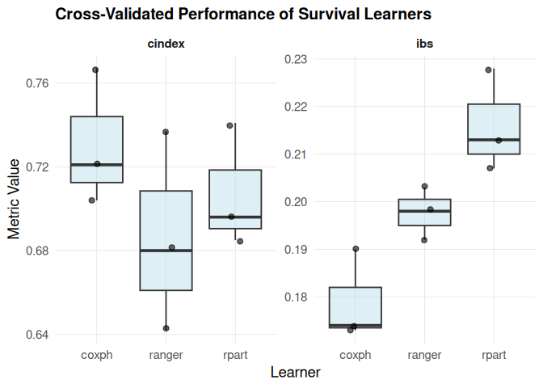

**5. Kaplan-Meier curves**

`plot_survcurve()` produces a styled Kaplan-Meier curve with a
confidence ribbon, log-rank p-value, and an aligned number-at-risk
table, in the spirit of `survminer::ggsurvplot()` but implemented
natively (no dependency on survminer).

``` r
plot_survcurve(Surv(time, status) ~ trt, data = veteran)
#> Warning: Removed 2 rows containing missing values or values outside the scale range
#> (`geom_ribbon()`).
```

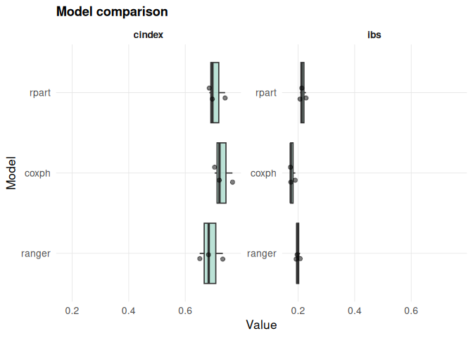

**6. Visualize interpretation**

``` r
shap_meanabs <- compute_shap(
  model         = mod_cox,
  newdata       = veteran[100,],
  baseline_data = veteran,
  times         = 80,
  sample.size   = 50,
  aggregate     = TRUE,
  method        = "meanabs"
  )

shap_meanabs
#>           feature         phi
#> age           age 0.003908879
#> celltype celltype 0.005120004
#> diagtime diagtime 0.000000000
#> karno       karno 0.036640340
#> prior       prior 0.000000000
#> trt           trt 0.000000000
```

``` r
plot_shap(shap_meanabs)
```

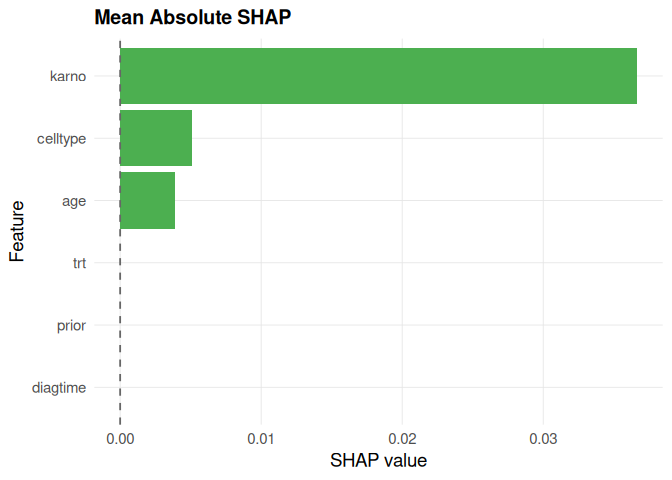

### More interpretability methods

`survalis` also provides PDP, ALE, surrogate explanations, tree
surrogates, permutation importance, interaction analysis, and
counterfactuals.

**Partial dependence and ICE**

``` r
pdp_age <- compute_pdp(
  model = mod_cox,
  data = veteran,
  feature = "age",
  times = c(100, 200, 300),
  method = "pdp+ice"
  )

plot_pdp(pdp_age, feature = "age", which = "per_time")
```

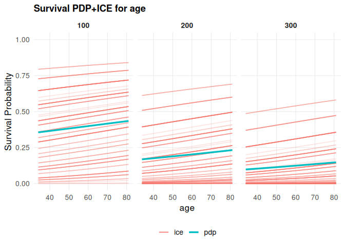

``` r
plot_pdp(pdp_age, feature = "age", which = "integrated", smooth = TRUE)
#> `geom_smooth()` using formula = 'y ~ x'
```

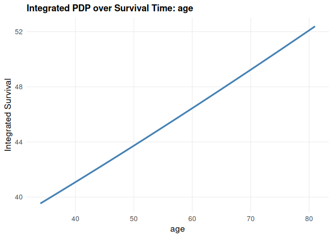

**Accumulated local effects**

``` r
ale_karno <- compute_ale(
  model = mod_cox,
  newdata = veteran,
  feature = "karno",
  times = c(100, 200, 300)
  )

plot_ale(ale_karno, feature = "karno", which = "per_time")
```

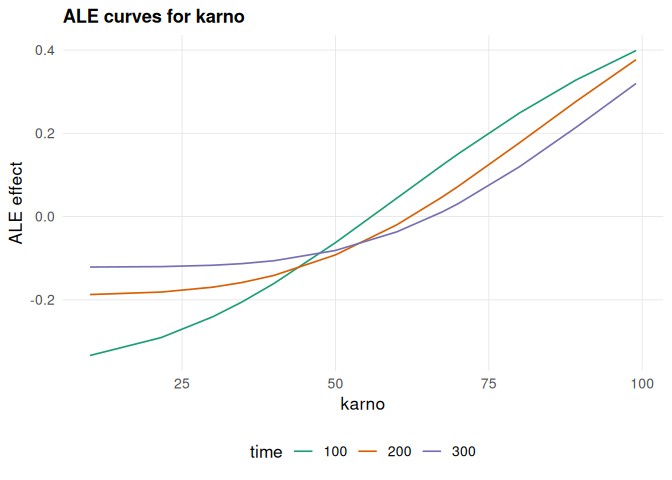

``` r
plot_ale(ale_karno, feature = "karno", which = "integrated", smooth = TRUE)
#> `geom_smooth()` using formula = 'y ~ x'
```

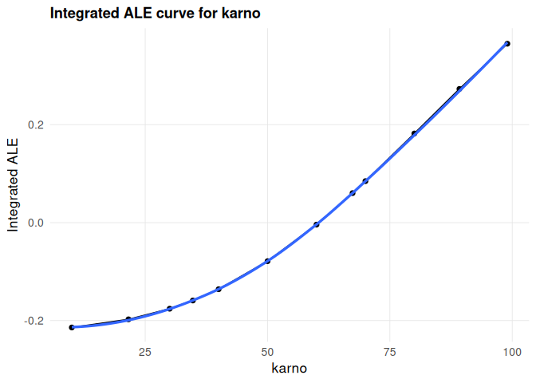

**Local surrogate explanation**

``` r
local_surrogate <- compute_surrogate(
  model = mod_cox,
  newdata = veteran[1, , drop = FALSE],
  baseline_data = veteran,
  times = c(100, 200, 300),
  target_time = 200,
  k = 5
  )

local_surrogate
#>    feature feature_value      effect target_time
#> 1    karno            60 0.491034890         200
#> 2 celltype      squamous 0.189632633         200
#> 3      age            69 0.120729843         200
#> 4 diagtime             7 0.001800378         200
#> 5    prior             0 0.000000000         200
plot_surrogate(local_surrogate, top_n = 10)
```

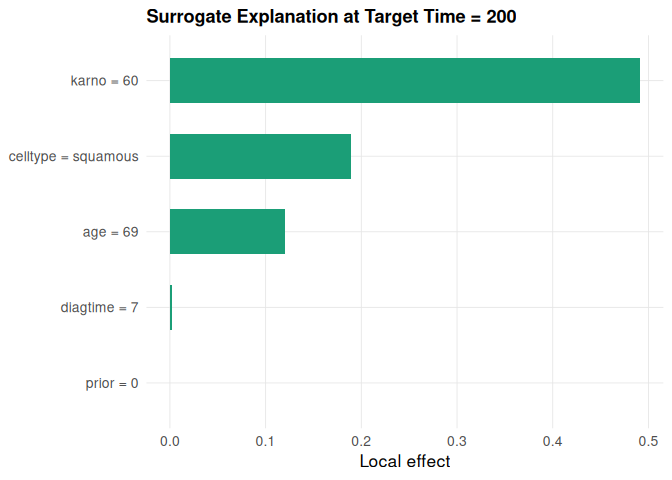

**Tree surrogate**

``` r
tree_surrogate <- compute_tree_surrogate(
  model = mod_cox,
  data = veteran,
  times = c(100, 200, 300)
  )

plot_tree_surrogate(tree_surrogate, type = "importance", top_n = 5)
```

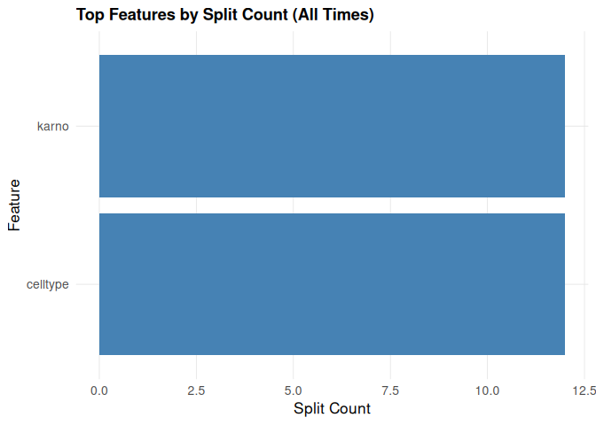

``` r
# plot_tree_surrogate(tree_surrogate, type = "tree")
```

**Permutation variable importance**

``` r
varimp_res <- compute_varimp(
  model = mod_cox,
  times = c(100, 200, 300),
  metric = "ibs",
  n_repetitions = 5,
  seed = 123
  )

varimp_res
#>     feature importance importance_05 importance_95 scaled_importance
#>      <char>      <num>         <num>         <num>             <num>
#> 1:    karno     0.0672        0.0494        0.0826         100.00000
#> 2: celltype     0.0468        0.0394        0.0574          69.64286
#> 3:      age    -0.0022       -0.0030       -0.0012           3.27381
#> 4:      trt     0.0000        0.0000        0.0000           0.00000
#> 5: diagtime     0.0000        0.0000        0.0000           0.00000
#> 6:    prior     0.0000        0.0000        0.0000           0.00000
plot_varimp(varimp_res)
```


**Feature interactions**

``` r
interaction_1way <- compute_interactions(
  model = mod_cox,
  data = veteran,
  times = c(100, 200, 300),
  target_time = 200,
  type = "1way"
  )

interaction_heatmap <- compute_interactions(
  model = mod_cox,
  data = veteran,
  times = c(100, 200, 300),
  target_time = 200,
  type = "heatmap"
  )

interaction_time <- compute_interactions(
  model = mod_cox,
  data = veteran,
  times = c(100, 200, 300),
  type = "time"
  )

plot_interactions(interaction_1way, type = "1way")
```

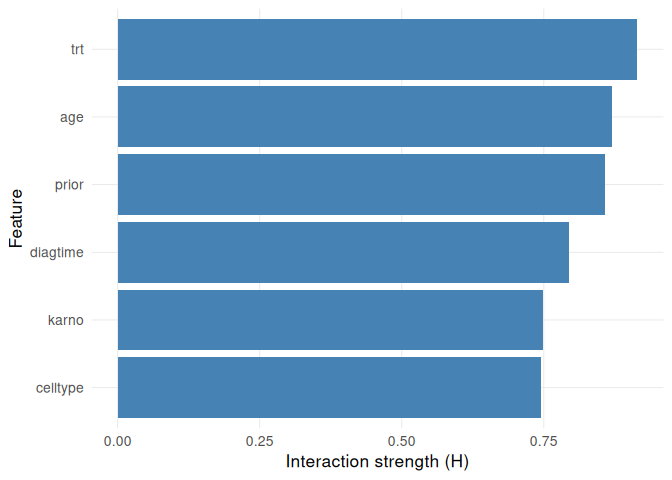

``` r
plot_interactions(interaction_heatmap, type = "heatmap")
```

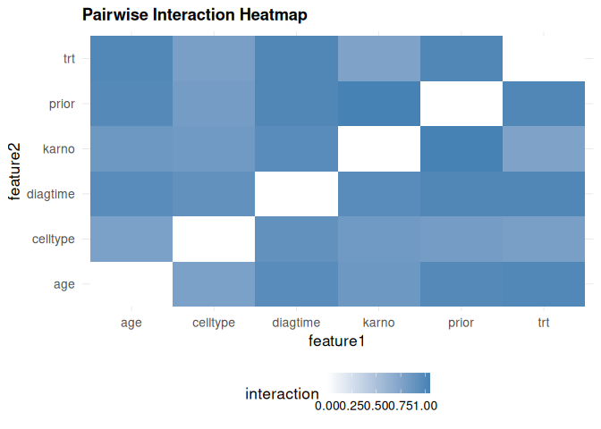

``` r
plot_interactions(interaction_time, type = "time")
```

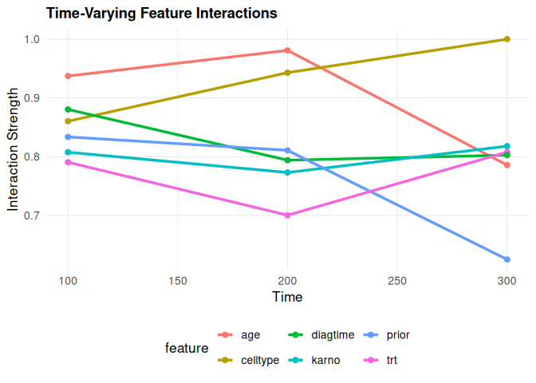

**Counterfactual explanations**

``` r
counterfactuals <- compute_counterfactual(
  model = mod_cox,
  newdata = veteran[1, , drop = FALSE],
  times = c(100, 200, 300),
  target_time = 200,
  features_to_change = c("age", "karno", "diagtime"),
  cost_penalty = 0.01
  )

counterfactuals
#>    feature original_value suggested_value survival_gain change_cost
#> 1    karno             60         81.0202        0.2347     21.0202
#> 2 diagtime              7          7.0808        0.0000      0.0808
#> 3      age             69         69.1313        0.0003      0.1313
#>   penalized_gain
#> 1         0.0245
#> 2        -0.0008
#> 3        -0.0010
```

**7. Calibration**

``` r
compute_calibration(
   model = mod_cox, data = veteran,
   time = "time", status = "status",
   eval_time = 80, n_bins = 10, n_boot = 30
   ) |> plot_calibration()
```

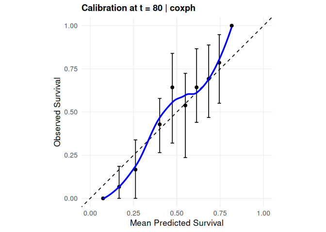

## Citing

``` r
citation("survalis")
```
